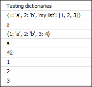
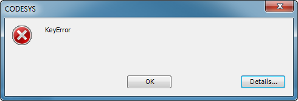
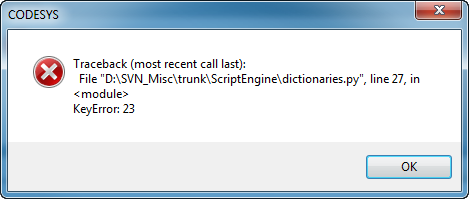

# Dictionary

Python also has a hash table type ( also "hashmap"). In contrast to the list, it can be indexed with any elements, for example strings. Its constructor is `dict()` and its literals are declared with braces `{}`.

The sample script `dictionaries.py` creates the output displayed below. In the last line, the script is terminated with a "KeyError" exception:

**Example: `dictionaries.py`**

```
from __future__ import print_function
print("Testing dictionaries")

# Declare a dictionary with three entries, the third being a list
d = {1: "a", 2: "b", "my list": [1, 2, 3]}
print(d)

# print the value of the key 1
print(d[1])

# remove the value with the key "my list"
del d["my list"]

# Add a value 4 with the key 3
d[3] = 4
print(d)

# The "get" method returns the second argument if the key cannot be found.
print(d.get(1, 42))
print(d.get(23, 42))

# print all keys in the dictionary
for key in d:
    print(key)

# index access for unknown keys will throw a "KeyError" exception!
print(d[23])
```

Resulting output:



And then in the last line, the script terminates:



Click the **Details** button to view the stack trace. Here you determine line number `27` and the unknown key `23`.



7.0

© Copyright 2026, CODESYS GmbH