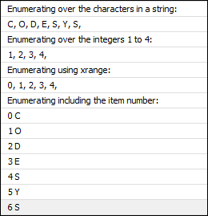

# Loops

As opposed to C and ST, `for` loops in Python do not count loop variables, but iterate over a sequence. This kind of sequence can be a "dictionary", a list, a tuple, the characters in a string, or lines in a file.

The following example shows some `for` loops:

**Example: loops.py**

```
from __future__ import print_function

print("Enumerating over a simple list:")
for i in (1,2,3,4):
    print(i, end=", ") # end= replaces the newline with ", "
print()                # but we still need a newline at the end of this case.

print("Enumerating over the characters in a string:")
for i in "CODESYS": # characters are representet as strings of length 1.
    print(i, end=", ")
print()

print("Enumerating over the integers 1 to 4:")
for i in range(1, 5): # upper bound is exclusive.
    print(i, end=", ")
print()

print("Enumerating using xrange:")
for i in xrange(5): # xrange is similar to range, but needs less memory for large ranges.
    print(i, end=", ")
print()

print("Enumerating including the item number:")
for i, v in enumerate("CODESYS"):
    print(i, v)
```

Resulting output:



If you require an index or number in addition to the item, then you should use `enumerate` as shown in the last case of the sample script. The following code is considered as poor style:

**Example: Poor style**

```
text = "CODESYS"

for i in range(len(text)):   # BAD STYLE!
    v = text[i]              # DON'T TRY THIS AT HOME!
    print(i, v)
```

Besides `for` loops, Python also has `while` loops which are very similar to those in C and ST:

**Example of "while" loop**

```
i = 0
while i < 3;
    print(i)
    i += 1
```

Note: This example is not very practical. You would more likely use a `for` loop with a range.

7.0

© Copyright 2026, CODESYS GmbH