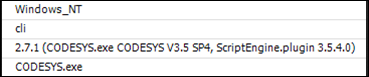

# Modules and standard libraries

In IEC, you can import libraries for reuse by other written code. As a pendant, there is the possibility in Python of importing modules.

The [Python standard library](https://docs.python.org/2/tutorial/classes.html) contains many modules for different purposes, such as:

* String processing
* Date and time handling
* Collections
* Threading
* Mathematical functions
* File handling
* Persistence
* Compression and archiving
* Database access
* Encryption services
* Network and Internet access
* Sending of emails

To create your own modules, write a Python file that defines the functions and classes that you want to provide. Save this file to the same directory as our sample script. If you name the file `mymodule.py`, then you can import it with `import mymodule`.

Here is an example of importing and using the cosine function and the pi constant from the `math` module:

**Example: Import mathematical function**

```
from math import cos, pi

print(pi) # prints 3.14159265359

print(cos(pi)) # prints -1.0
```

The following contains more examples that access information about the operating system, the Python version, and the interpreter:

**More import examples**

```
import os
print(os.environ["OS"])

from sys import platform, version, executable
print(platform)
print(version)
print(executable)
```



There is a special module `__future__` for activating new language features. Above all, it is used when Python developers introduce new functionalities that are backward compatible. These kinds of functionalities have to be activated with special "`__future__` imports". One example that we use in most of our sample scripts here is the activation of the new power syntax of `print` as a function instead of a statement.

**Example: "\_\_future\_\_"**

```
# make print() a function instead of a statement
from __future__ import print_function
```

The Python documentation provides a complete [list of all `__future__` imports](https://docs.python.org/2/library/__future__.html).

In addition to the normal Python modules, IronPython code can also access .NET assemblies as if they were Python modules. This opens the access to the [.NET framework class library](https://msdn.microsoft.com/en-us/library/hfa3fa08%28v=vs.110%29.aspx) and third-party libraries. Here is an example how to open a dialog by means of the `Windows Forms` library:

**Example: Opening a .NET dialog**

```
import clr
clr.AddReference("System.Windows.Forms")
from System.Windows.Forms import MessageBox

MessageBox.Show("Hello")
```

7.0

© Copyright 2026, CODESYS GmbH