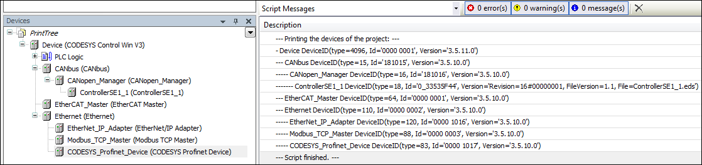

# Example: Printing the device tree of the current project

The script `PrintDeviceTree.py` is an example for navigating in a project. It creates the output of a hierarchical display of all devices in the open project.

Load a project that contains some device objects and execute the script.

**Example: `PrintDeviceTree.py`**

```
# encoding:utf-8
# We enable the new python 3 print syntax
from __future__ import print_function

# Prints out all devices in the currently open project.

print("--- Printing the devices of the project: ---")

# Define the printing function. This function starts with the
# so called "docstring" which is the recommended way to document
# functions in python.
def print_tree(treeobj, depth=0):
    """ Print a device and all its children

    Arguments:
    treeobj -- the object to print
    depth -- The current depth within the tree (default 0).

    The argument 'depth' is used by recursive call and
    should not be supplied by the user.
    """

    # if the current object is a device, we print the name and device identification.
    if treeobj.is_device:
        name = treeobj.get_name(False)
        deviceid = treeobj.get_device_identification()
        print("{0}- {1} {2}".format("--"*depth, name, deviceid))

    # we recursively call the print_tree function for the child objects.
    for child in treeobj.get_children(False):
        print_tree(child, depth+1)

# We iterate over all top level objects and call the print_tree function for them.
for obj in projects.primary.get_children():
    print_tree(obj)

print("--- Script finished. ---")
```

The device tree (from the "Devices" view) is displayed in the message view and all non-device objects are left out:



7.0

© Copyright 2026, CODESYS GmbH