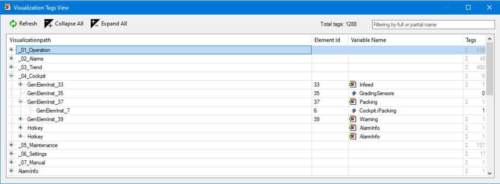

# Display software metrics (visualization license) as text

The **Visualization Tags View** dialog gives you detailed information about the variables used for the visualization in the project, the determined number of tags, and the call position as the visualization path. These were used for the **Number of visualization tags** software metric based on your application.

**Visualization Tags View**

* Provides a detailed overview of the counted tags
* Lists variables (tags) which are used in a specific visualization
* Displays the call position as a visualization path

For more information, see the following: [Command: Visualization Tags View](_visu_cmd_tags_view.html#_visu_cmd_tags_view)

**Example**

17.0

© Copyright 2026, CODESYS GmbH