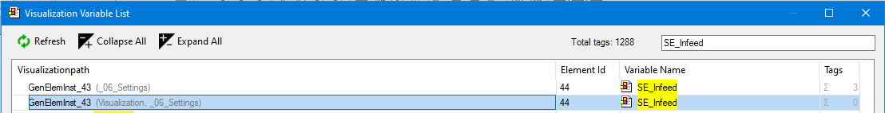
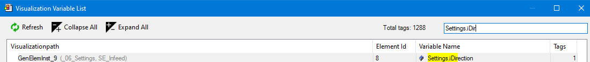

# Filter function

The visualization tags view with the **Filtering by full or partial name** filter function supports you with the following tasks and questions:

* Where does a visualization object (template) occur?

  **Example**

  Filtering by the call locations of the visualization object

  The `SE_Infeed` visualization is used in the `_06_Settings` visualization. And the `_06_Settings` visualization is called in the `Visualization` visualization.

  
* Where does a tag (variable) occur?

  **Example**

  Filtering by the call locations of a tag (variable)

  The `Settings.iDirection` tag (variable) is used in the `SE_Infeed` visualization.

  

17.0

© Copyright 2026, CODESYS GmbH