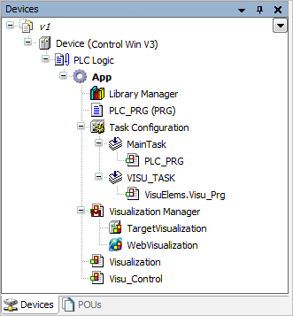

# Creating visualization objects in the project

For each visualization, you insert a **Visualization** object into your project like any other object. This also applies to visualizations that should be used later only within other visualizations. You can insert the new visualization object directly below an application, or below the root node of the **Devices** view (for availability throughout the entire project).

The required base libraries and other objects, such as the Visualization Manager, are inserted automatically. When you insert the visualization object below an application, the subordinate objects for the display variants supported by the device are also displayed.

Every visualization object can be edited separately in the visualization editor.

The following steps describe a simply example for creating an object for an application-specific visualization.

1. Open a project with an application.
2. Click **Add** to close the dialog.

   * In the device tree, the **Visualization Manager** and **Visualization** objects are inserted below the application. Depending on the device in use, the **TargetVisu** and/or **WebVisu** objects are also created below the Visualization Manager.

     If a **TargetVisu** object or **WebVisu** object is created, then a **VISU\_TASK** object is also created below the task configuration with an implicit program call.

     The required visualization libraries are added automatically in the **Library Manager** of the application.

     The visualization editor opens with the **Visualization** editor view and the **Visualization ToolBox** and **Properties** views.

     In the **Visualization ToolBox** view, there is a **Symbols** button for viewing the symbols from the library `VisuSymbols.library`.

     In the visualization editor, create the desired visualization.

Example of a device tree with two inserted visualizations:

TIP:

You can create a user interface from multiple visualization objects and link their pages using the [Visualization Element: Frame](_visu_elem_frame.html#_visu_elem_frame) or [Visualization Element: Tabs](_visu_elem_tab.html#_visu_elem_tab) structure elements. The **Frame** structure element references a visualization object whose images then appear as one page of a versatile user interface. The **Tabs** structure element can display multiple visualizations.

You can display dialogs to request information from the visualization user in your user interface. To output information, you can display the message view. You design dialogs and messages as a special visualization object (type: **Dialog**) whose image appears when the visualization user performs a certain input action. Usually a dialog opens after clicking a button.

TIP:

For creating an application-dependent visualization, insert the visualization object directly below the root node of the device tree. This corresponds to insertion in the **POUs** view. In this case, a Visualization Manager is **not** created with objects for the display variants.

17.0

© Copyright 2026, CODESYS GmbH