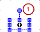
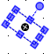

# Configuring the size and position in the editor

The size and position of an element are specified as pixel coordinates in the **Properties** view. These settings are displayed graphically in the editor view at the same time.

When you drag a visualization element from the **Visualization Toolbox** view to the editor view, it is shown as selected, as in the following example of a rectangle element:

The possible positions depend on the set grid. You can change its settings in the CODESYS options. Commands in the context menu are available for alignment and grouping.

Now you can move or resize the element directly in the editor. As an alternative, you configure the **Position** property in the properties editor, which opens automatically for the selected element. See the description for this, for example in the help page for the **Button** element. The changes are also updated in the other editor.

**Changing the element size and position in the editor**

1. Focus the element so that the shape of the mouse pointer indicates movement (example: ).
2. Drag the blue box to resize the element.

   * The position of the element is also updated in the **Position → Height** and **Position → Width** properties.

Moreover, you can rotate the **Rectangle**, **Line**, **Polygon**, and **Pie** elements.

**Static rotation of rectangle, line, polygon, pie, or image**

1. Select the element for static rotation. Example: Rectangle

   * The rectangle is displayed with a handle next to the movable position boxes.

     

     Handle
2. Rotate the element to any position.

   * 

     In the **Position → Angle** property, the set angle is displayed in degrees.

For more information, see: [Configure the rotating element](_visu_configure_rotation_and_translation.html#_visu_configure_rotation_and_translation)

17.0

© Copyright 2026, CODESYS GmbH