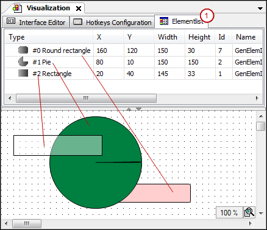

# Moving the visualization element forward and back

Each visualization element is in its own layer of the visualization (Z-axis). It can be hidden by other elements in the foreground and hide other elements in the background. The order of layers is visible on the **Element List** tab above the editor view. The order of elements from front to back specifies the order of visualization layers from back to front.

Use the commands from the **Order** context menu to move a selected element.

Example of an element list (1):

17.0

© Copyright 2026, CODESYS GmbH