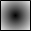

# Designing a visualization element with a color gradient

Requirement: The visualization editor is open.

1. Drag a **Rectangle** element to the visualization.
2. Define the color gradient for the element:

   * **Gradient type**: **Radial**
   * **Standard radial**: **Center**
   * The fill color of the element changes radially from white to black.

     

17.0

© Copyright 2026, CODESYS GmbH