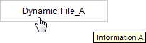

# Dynamically output text from a text list

You can dynamically output text with the help of the **Text Field** element. You can implement a text output by a user input or programmatically.

Requirement: A project with a visualization is open.

1. Open the visualization and add a **Text Field** element.

   * The **Properties** view shows the configuration of the element.
2. Compile, download, and start the application.

   * The application runs. The visualization opens. The text `None` is output in the text field. If you as the user click the element, the text changes to `Dynamic_ File_A`. In addition, the matching tooltip is shown: `Information A`. The text changes with each click according to the CASE instruction.

     

CASE statement

```
CASE iText OF
    0:  strTextID := '0';
        strToolTipID := '0';

    1:  strTextID := '1';
        strToolTipID := '4';

    2:  strTextID := '2';
        strToolTipID := '5';

    3:  strTextID := '3';
        strToolTipID := '6';
ELSE
    strTextID := '0';
    strToolTipID := '0';
END_CASE;
```

17.0

© Copyright 2026, CODESYS GmbH