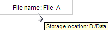

# Showing text as a tooltip

Requirement: A project with a visualization is open.

1. Open the visualization and add a **Text Field** element.

   * The **Properties** view shows the configuration of the element.
2. Compile, download, and start the application.

   * The application runs. The visualization opens. The element outputs the text: `File name: File_A` When the mouse pointer moves over the text field, the tooltip appears: `Location : D/Data`.

     

17.0

© Copyright 2026, CODESYS GmbH