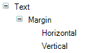
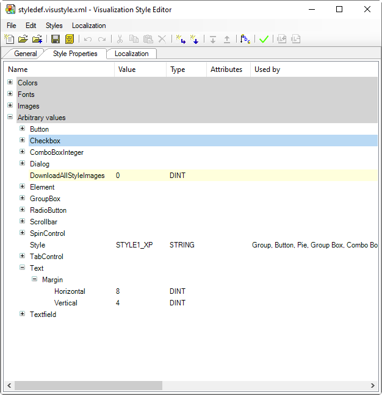

# Aligning Text with Spacing to the Element Frame

Elements with the **Horizontal alignment** or **Vertical alignment** element property can not only align their text vertically or horizontally, but also use their style to align the text so that the text is displayed with spacing (in pixels) from the element edge.

In addition, define the following style properties in your style:

Style property for text alignment with spacing 

**The affects the following elements:**

* [Visualization Elements: Rectangle, Rounded Rectangle, Ellipse](_visu_elem_rectangle.html#_visu_elem_rectangle)
* [Visualization Element: Line](_visu_elem_line.html#_visu_elem_line)
* [Visualization Elements: Polygon, Polyline, and Bézier Curve](_visu_elem_polygon.html#_visu_elem_polygon)
* [Visualization Element: Pie](_visu_elem_pie.html#_visu_elem_pie)
* [Visualization Element: Image](_visu_elem_image.html#_visu_elem_image)
* [Visualization Element: Button](_visu_elem_button.html#_visu_elem_button)
* [Visualization Element: Tabs](_visu_elem_tab.html#_visu_elem_tab)
* [Visualization Element: Frame](_visu_elem_frame.html#_visu_elem_frame)
* [Visualization Element: Label](_visu_elem_label.html#_visu_elem_label)
* [Visualization Element: Table](_visu_elem_table.html#_visu_elem_table)
* [Visualization Element: Text Field](_visu_elem_text_field.html#_visu_elem_text_field)
* [Visualization Element: Scroll Bar](_visu_elem_scrollbar.html#_visu_elem_scrollbar)
* [Visualization Element: Spin Box](_visu_elem_spin_control.html#_visu_elem_spin_control)
* [Visualization Element: Check Box](_visu_elem_check_box.html#_visu_elem_check_box)

  Note: The element already has a native left alignment of 5 pixels. If a horizontal spacing value is also specified in the style, then the larger of the two is used.
* [Visualization Element: Radio Buttons](_visu_elem_radio_button.html#_visu_elem_radio_button)

  Note: The element already has a native left alignment of 5 pixels. If a horizontal spacing value is also specified in the style, then the larger of the two is used.
* [Visualization Element: Combo Box, Array](_visu_elem_combo_box_array.html#_visu_elem_combo_box_array)
* [Visualization Element: Combo Box, Integer](_visu_elem_combo_box_integer.html#_visu_elem_combo_box_integer)
* [Visualization Element: Alarm Banner](_visu_elem_alarm_banner.html#_visu_elem_alarm_banner)
* [Visualization Element: Alarm Table](_visu_elem_alarm_table.html#_visu_elem_alarm_table)

The spacing value is applied only when the alignment is not centered.

**Example: Visualization style `Test for text field margin`**

17.0

© Copyright 2026, CODESYS GmbH