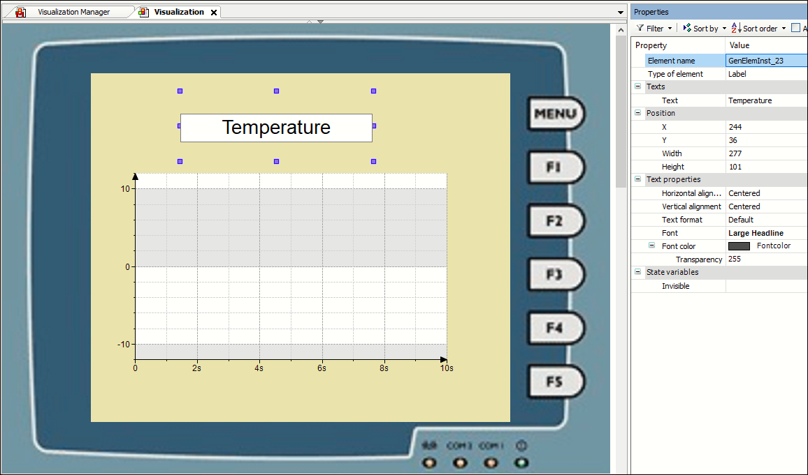

# Configuring a "device image"

A device image in the background is used as help when creating visualizations for a specific device. In the instructions below, you can see how to use a device image to represent a control panel. If you use this as a background, then you can use it as a guide when creating visualizations and correctly place elements accordingly.

Example of a "device image" as background for a visualization 

1. In the **Devices** view, double-click the **Visualization Manager**. In the opening dialog, switch to [Tab: Advanced Settings](_visu_manager_advanced_settings.html#_visu_manager_advanced_settings).
2. Save the settings as default for the current device. Each additional visualization below an application for this device (even in other projects) will now also get the defined background.

   * Now place elements in the visualization as you like. You will notice that this is only possible within the defined "content area".

TIP:

In the [Visualization options](_visu_dlg_options.html#_visu_dlg_options) **(device image)**, you can set in which operating modes (online, offline) the device image should be displayed.

17.0

© Copyright 2026, CODESYS GmbH