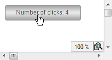

# Configuring User Inputs

Requirement: A project with a visualization is open.

1. Open the visualization and add a **Button** element.

   * The **Properties** view opens for the new button.
2. Compile, download, and start the application.

   * The application runs. The visualization opens. When the user clicks the button, the action is executed, the variable `PLC_PRG.iClicks` is incremented, and the number of clicks is printed.

     

17.0

© Copyright 2026, CODESYS GmbH