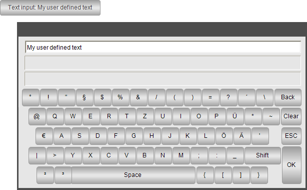

# Configuring text input especially for the virtual keyboard `VisuDialogs.Keypad`

Requirement: A project with a visualization is open.

1. Declare an input variable in the `PLC_PRG` program.

   * Declaration

     ```
     VAR_INPUT 
         stInput : STRING; 
     END_VAR
     ```
2. As a visualization user, click the button.

   * The virtual keyboard is displayed and allows text input by means of the mouse.

     

17.0

© Copyright 2026, CODESYS GmbH