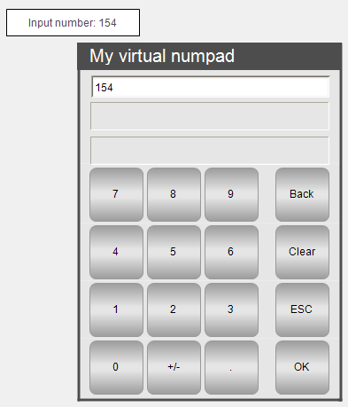

# Configuring numeric input especially for virtual numeric keypads

Requirement: A project with a visualization is open.

1. Declare an input variable in the `PLC_PRG` program.

   * Declaration

     ```
     VAR_INPUT 
         iInput : INT; 
     END_VAR
     ```
2. Compile, download, and start the application.

   * The application runs. The visualization opens. When a user clicks the rectangle, the numeric keypad opens.

     

17.0

© Copyright 2026, CODESYS GmbH