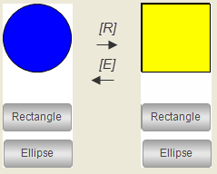

# Configuring hotkeys for elements

You can define a hotkey that triggers an action for an element. The element has to be visible and operable. For this purpose, the **Input configuration → Hotkey** property is available in the **Properties** view of the visualization editor.

Requirement: A CODESYS project with the existing `visEllipse` and `visRectangle` visualizations is open.

1. Select the application in the device tree and add a visualization named `visMain`.

   * The visualization editor opens.
2. Click **Online → Login** for the device and start the application.

   * The visualization starts. It has a frame where one of the referenced visualizations runs. Focus on the `visEllipse` visualization and press **E**. The visualization switches the contents in the frame to the `visEllipse` visualization. When you press **R**, the visualization switches the contents in the frame to the `visRectangle` visualization.

     

17.0

© Copyright 2026, CODESYS GmbH