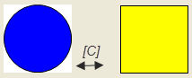

# Configuring hotkeys for a specific visualization

You can define hotkeys that trigger an input action on a specific visualization. The **Keyboard Configuration** tab in the editor of the visualization is used for this purpose.

Requirement: A CODESYS project with the `visEllipse` and `visRectangle` visualizations is open.

1. Open the CODESYS TargetVisu object and select `visEllipse` as the start visualization.
2. Click **Online → Login** for the device and start the application.

   * The visualization starts and displays an ellipse. Focus on the `visEllipse` visualization and press **C**. The `visRectangle` visualization is displayed. Focus on the visualization and press **C** again. Now the visualization is switched again to `visRectangle`.

     

17.0

© Copyright 2026, CODESYS GmbH