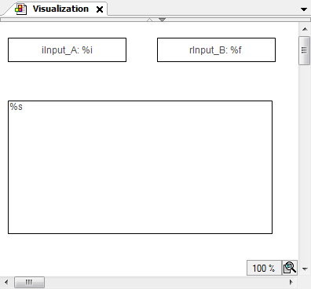

# Capturing the writing of variables

When the user completes the input of a value (in an input field), an edit control event is closed. You can capture this event in the application as follows.

1. Create a function block that implements the interface `VisuElems.IEditBoxInputHandler` from the library `VisuElemBase`.
2. Pass the instance to the global event manager `VisuElems.Visu_Globals.g_VisuEventManager` by calling the method `SetEditBoxEventHandler`.

**Example**

A visualization has two input fields for `iInput_A` and `rInput_B` and one text output element.

The input fields are rectangles that the user is prompted to click in order to input text.

The text output element is a rectangle where the contents of the text variable `PLC_PRG.stInfo` are printed. The text variable contains the last input by a user in one of the input fields and the additional information that was added.



|  |  |
| --- | --- |
| Properties of the rectangle `iInput_A` | |
| **Texts → Text** | `iInput_A: %i` |
| **Text variables → Text variable** | `PLC_PRG.iInput_A` |
| Properties of the rectangle `rInput_B` | |
| **Texts → Text** | `iInput_B: %i` |
| **Text variables → Text variable** | `PLC_PRG.rInput_B` |
| Properties of the rectangle for the text output | |
| **Texts → Text** | `%s` |
| **Text variables → Text variable** | `PLC_PRG.stInfo` |

Implementation of `PLC_PRG`

```
PROGRAM PLC_PRG
VAR_INPUT
    iInput_A:INT;  (* Used in the visualization as user input variable*)
    rInput_B:REAL; (* Used in the visualization as user input variable*)
    stInfo : STRING;  (* Informs about the user input via the edit control field;
                        String gets composed by method 'VariableWritten;
                        Result is displayed in the lower rectangle of the visualization *)
END_VAR
VAR
    inst : POU;
    bFirst : BOOL := TRUE;
END_VAR

IF bFirst THEN
    bFirst := FALSE;
    VisuElems.Visu_Globals.g_VisuEventManager.SetEditBoxEventHandler(inst);
    (* Call of method VariableWritten *)
END_IF
```

Implementation of `POU`

```
FUNCTION_BLOCK POU IMPLEMENTS VisuElems.IEditBoxInputHandler
(* no further declarations, no implementation code *)
```

Method `VariableWritten` assigned to `POU`

```
METHOD VariableWritten : BOOL
(* provides some information always when an edit control field is closed in the visualization, that is a variable gets written by user input in one of the upper rectangles *)
VAR_INPUT
    pVar : POINTER TO BYTE;
    varType : VisuElems.Visu_Types;
    iMaxSize : INT;
    pClient : POINTER TO VisuElems.VisuStructClientData;
END_VAR

// String stInfo, which will be displayed in the lower rectangle, is composed here
PLC_PRG.stInfo := 'Variable written; type: ';
PLC_PRG.stInfo := CONCAT(PLC_PRG.stInfo, INT_TO_STRING(varType));
PLC_PRG.stInfo := CONCAT(PLC_PRG.stInfo, ', adr: ');
PLC_PRG.stInfo := CONCAT(PLC_PRG.stInfo, DWORD_TO_STRING(pVar));
PLC_PRG.stInfo := CONCAT(PLC_PRG.stInfo, ', by: ');
PLC_PRG.stInfo := CONCAT(PLC_PRG.stInfo, SEL(pClient^.globaldata.clienttype = VisuElems.Visu_ClientType.Targetvisualization,'other visu', 'targetvisu'));
```

17.0

© Copyright 2026, CODESYS GmbH