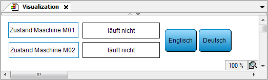

# Configuring language switching for texts from text lists

NOTE:

**Client-dependent language**

The language can be switched individually for each client. The requirement is that the CODESYS Visualization add-on is installed in at least version 4.7.0.0 and the runtime system in version >= V3.5 SP20. When the visualization is started, it is displayed in the language set in the browser (for example, **de** or **en**). This language must be available in the project. If the language is not available, then the default texts are displayed.

In version 4.6.0.0 and lower, the language was switched for all clients simultaneously.

Requirement: An empty visualization object is inserted into the project and it is open for editing in the visualization editor. There is also a **Visualization Manager** object. User management is not created for the visualization.

The following instructions provide a simplified example:

* By means of two buttons, the user should be able to toggle the visualization texts between English and German.
* Static texts in the visualization include the labels "State, Machine 01", "State, Machine 02", "English", and "German". These texts are located in the **GlobalTextList** in English and German.

  Dynamic texts will describe the state of both machines. The texts are provided in the text list **Status\_Texts** in English (`en`) and German (`de`).

1. Drag a **Text Field** from the **Visualization Toolbox** view (**Common Controls** category) to the editor view. Specify the value `State, Machine M01` in the properties editor for the **Texts → Text** element property.
2. Click the **German** button.

   * The language changes to German:

     

For more information, see: [Input Action: Change Language](_visu_dlg_input_configuration_change_language.html#_visu_dlg_input_configuration_change_language)

17.0

© Copyright 2026, CODESYS GmbH