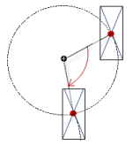

# Rotation around a fixed point

An element can be rotated around a fixed point. Under the **Center** property, define the fixed point with X/Y coordinates. The midpoint of the element is calculated internally. The alignment of the element is does not change with respect to the coordinate system.

When the visualization is run, the element is moved so that its midpoint draws a circular path around the fixed point (center).

TIP:

Note that no movement occurs in a configuration where the midpoint and center coincide.

Requirement: A project with a visualization is open.

1. Open the visualization and add a **Rectangle** element.

   * The **Properties** view shows the configuration of the element.
2. Compile, download, and start the application.

   * The application runs. The visualization opens. The rectangle rotates about the center. The alignment of the element is fixed according to the coordinate system.

     

17.0

© Copyright 2026, CODESYS GmbH