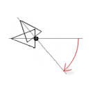

# Rotating element

Interior rotation

An element can also perform a self-rotation. To do this, configure the **Interior rotation** property. Under the **Center** property, define the fixed point with X/Y coordinates. The midpoint of the element is calculated internally. In addition, the position changes of the element must be programmed.

When executed, the element rotates around this fixed point. Then the alignment of the element rotates with respect to the coordinate system.

TIP:

Note that the element rotates at the position when the midpoint and center coincide.

Requirement: A project with a visualization is open.

1. Open the visualization and add a **Polygon** element that you shape into a pointer.

   * The **Properties** view shows the configuration of the element.
2. Compile, download, and start the application.

   * The application runs. The visualization opens. The pointer rotates about its base. The angle of rotation increases continuously starting at the position that determines the static angle of rotation, because the static angle of rotation is added to the angle of rotation. The static angle of rotation acts as an offset.

     

17.0

© Copyright 2026, CODESYS GmbH