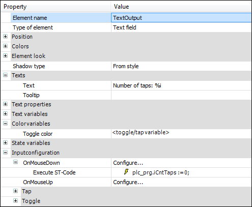

# Animating the button state

Define the input event to which a button responds by selecting an input event (mouse click event) under the **Input configuration** property. There you configure the action that is triggered.

Define the behavior of the button according to user input. When you assign a variable to the **Input configuration**, **Toggle** property, you configure a button that behaves like a switch. When you assign a variable to the **Input configuration**, **Tap** property, you configure a button that behave like a push button.

The **Button state variable** property controls whether the display of the button is pressed or not pressed. When you insert a button into your visualization, the property is assigned the placeholder **<toggle/tap variable>**. This has the effect that the display of the button reacts automatically to user input. When you specify a variable instead of the placeholder, you can program the display of the button yourself. In this way, you define when and how the button is displayed by setting the variable specified in the properties accordingly in the code.

**Example**

A visualization consists of the "push button" and a text field, which displays the number of button events.

If the "push button" detects a mouse click at runtime, then the color changes and the button is displayed as pressed. A counter variable is also incremented. After the mouse click, the button is blue again and not pressed. Moreover, the current variable value is permanently displayed in the text field. When the text field is clicked, the counter variable is set to zero.

**Configuring push buttons with text output**

1. Drag a **Button** element to the editor.

   * The **Button state variable** property is assigned the **<toggle/tap variable>** placeholder. Now the representation of the button is coupled with user input.
2. Input the following code:

   ```
   PLC_PRG.iCntTaps := 0;
   ```

   * The reset of the counter is implemented as the follow-up action.

     The text field is configured.

     

17.0

© Copyright 2026, CODESYS GmbH