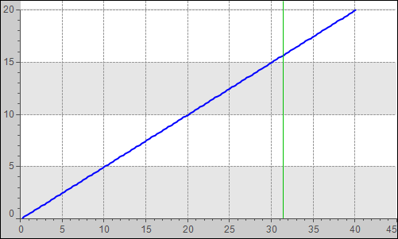

# Displaying data as a curve in the Cartesian coordinate system

Initial situation: A project is open. The application in it provides the array data `PLC_PRG.DataX` and `PLC_PRG.DataY`, which is to be displayed as a curve in the Cartesian coordinate system.

```
PROGRAM PLC_PRG
VAR
    DataX : ARRAY [1..200] OF REAL ;
    DataY : ARRAY [1..200] OF REAL ;
    xDoIt : BOOL := FALSE;
    ix : INT;
END_VAR
IF xDoIt THEN
    xDoIt := FALSE;
    FOR ix := 1 TO 200 BY 1 DO
        DataX[ix] := (ix * 0.2) + 0.1;
        DataY[ix] := (ix * 0.1);
    END_FOR
    xDoIt := TRUE;
END_IF
```

**Configuring the **Cartesian XY Chart** element**

1. In the **Devices** view, add a visualization below the application. Assign the name `VisMain` to the visualization.

   * The visualization editor is open.
2. Compile, download, and start the application. Force the variable `xDoIt` to `TRUE`.

   * The target visualization opens. `Curve1` is displayed in the Cartesian coordinate system.

     

17.0

© Copyright 2026, CODESYS GmbH