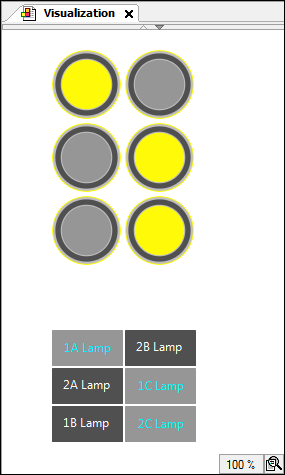

# Configuring and multiplying lamps and buttons as templates

1. Create a new standard project.

   * A CODESYS Control Win is configured as the device. The `MainTask` calls `PLC_PRG`. The implementation language is ST.
2. Build, start, and download the application.

   * Visualization at runtime:

     

17.0

© Copyright 2026, CODESYS GmbH