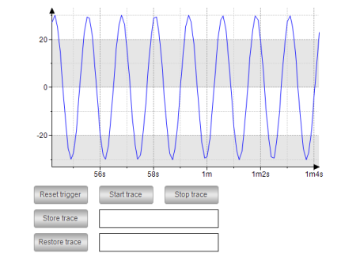

# Example

**Record the sine-shaped data of the IEC variable `PLC_PRG.rSin`**

The `PLC_PRG` program is running on the controller. When you follow the "Getting Started" instructions, the following interface is displayed:

You can control the trace record by clicking the buttons.

17.0

© Copyright 2026, CODESYS GmbH