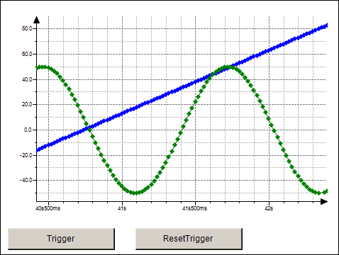

# Displaying Data Graphs with Trace

With this element, you can integrate a trace graph in the visualization that monitors and displays variable values permanently. You configure the displayed trace graph in the element properties. In addition, you can add controls that control the trace functionality. This is done manually or by means of the **Insert Elements for Controlling Trace** command.

TIP:

Configurations for that Visualization Element: Trace can be taken over from an object Trace.

17.0

© Copyright 2026, CODESYS GmbH