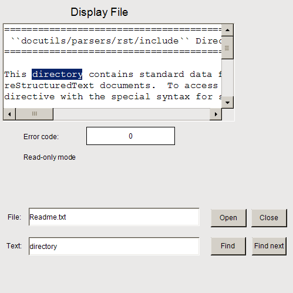

# Configuring the display of a text file

To display a text file located on the controller, you need controls for selecting, opening, and closing the file in addition to the **Text Editor** element. As an option, additional controls can also be used to set up a text search in the file.



**Configuring the **Text Editor** element, example**

1. Drag a **Text Editor** element to the visualization editor.
2. Continue configuring the **Control variables** property.

   **Assign the following variables there:**

   * **Control variables → File → Variable**: `g_sFileName`
   * **Control variables → File → Open**: `g_bFileOpen`
   * **Control variables → File → Close**: `g_bFileClose`
   * **Control variables → File → New → Variable**: `g_bFileNew`
   * **Control variables → File → Save → Variable**: `g_bFileSave`
   * **Control variables → Edit → Variable**: `g_sEditSearchFor`
   * **Control variables → Edit → Find**: `g_bEditFind`
   * **Control variables → Edit → Find Next**: `g_bEditFindNext`

Declaration of control variables

```
VAR_GLOBAL
    g_sFileName: STRING := 'Readme.txt';
    g_bFileOpen : BOOL;
    g_bFileClose: BOOL;
    g_bFileNew: BOOL;
    g_bFileSave: BOOL;
    g_sEditSearchFor : STRING;
    g_bEditFind : BOOL;
    g_bEditFindNext : BOOL;
    g_usiErrorHandlingVarForErrorCode: USINT;
    g_bVarForContentChanged : BOOL;
    g_bVarForReadWriteMode: BOOL;
END_VAR
```

**Configuring control elements for file selection**

1. Add a **Label** element.
2. Configure the **Input configuration → OnMouseclick** property with **Switch Variable**.

   Assign `g_bEditFile` as the variable.

   * The `Close` button is configured.

**Controls for searching for a text**

1. Add a **Label** element.
2. Also add the **Execute ST code** action.

   Program: `g_bEditFindNext := TRUE;`

   * The button is configured.

17.0

© Copyright 2026, CODESYS GmbH