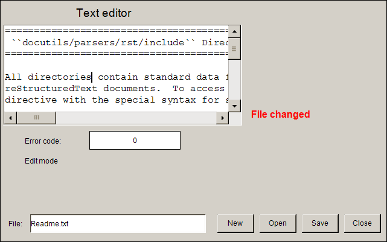

# Configuring the editing of a text file

To use the **Text Editor** in the user interface to create or edit a text file on the controller, you need controls for selecting, opening, closing, saving, and creating a file in addition to the **Text Editor** element.

Example:



**Configuring the **Text Editor** element, example**

1. Drag a **Text Editor** element to the visualization editor.
2. Continue configuring the **Control variables** property.

   **Assign the following variables there:**

   * **Control variables → File → Variable**: `g_sFileName`
   * **Control variables → File → Open**: `g_bFileOpen`
   * **Control variables → File → Close**: `g_bFileClose`
   * **Control variables → File → Save**: `g_bFileSave`
   * **Control variables → File → New**: `g_FileNew`

Declaration of control variables

```
VAR_GLOBAL
    g_sFileName: STRING := 'Readme.txt';
    g_bFileOpen : BOOL;
    g_bFileClose: BOOL;
    g_bFileSave: BOOL;
    g_FileNew: BOOL;
    g_usiErrorHandlingVarForErrorCode: USINT;
    g_bVarForContentChanged : BOOL;
    g_bVarForReadWriteMode: BOOL;
END_VAR
```

**Configuring control elements for file selection**

1. Add a **Label** element.
2. Configure the **Input configuration → OnMouseclick** property with **Switch Variable**.

   Assign `g_bEditFile` as the variable.

   * The `Close` button is configured.

17.0

© Copyright 2026, CODESYS GmbH