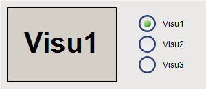
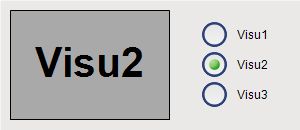
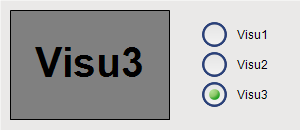

# Switching frame visualizations by means of a variable

In the main visualization, the **Frame** element displays one of the referenced frame visualizations at runtime. The user can select the **Radio Buttons** element which is displayed in the frame.

**Connecting frame visualizations with a radio buttons element**

1. Create a new standard project in CODESYS.
2. Click **Online → Login** and start the application.

   * The visualization starts. One of the referenced visualizations is running in the frame. When you click an unselected option of the **Radio Buttons** element, the visualization switches the contents in the frame to the desired visualization.

     

     

     

In the example, the switch frame variable is connected to an input variable. Instead, you can also set the switch frame variable programmatically in the IEC code.

17.0

© Copyright 2026, CODESYS GmbH