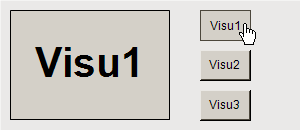
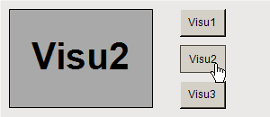
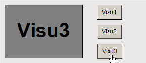

# Switching frame visualizations by means of a follow-up action

In the main visualization, the **Frame** element displays one of the frame visualizations at runtime. The user can use buttons to control the display in the frame. The user input triggers the **Switch frame visualization** input action.

**Programming a visualization**

1. Create a new standard project in CODESYS.
2. Click **Online → Login** for the device and start the application.

   * The visualization starts. One of the referenced visualizations is running in the frame. When you click one of the buttons, the visualization switches the contents in the frame to the respective visualization.

     

     

     

17.0

© Copyright 2026, CODESYS GmbH