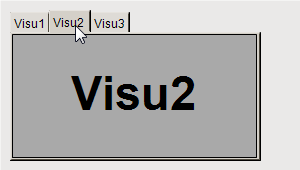

# Displaying visualizations on a tabs element

For the **Tabs**, the navigation of the referenced visualizations is provided automatically. The first of the referenced visualizations is in the foreground, while the others are hidden "behind it". The user can navigate between them by means of the tabs which are provided automatically.

**Configuring a tabs element**

1. Create a new standard project in CODESYS.
2. Click **Online → Login** for the device and start the application.

   * The visualization starts. One of the referenced visualizations is running in the **Tabs** element. Click the tab to switch to the respective visualization.

     

17.0

© Copyright 2026, CODESYS GmbH