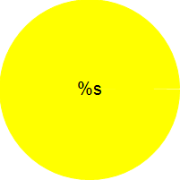
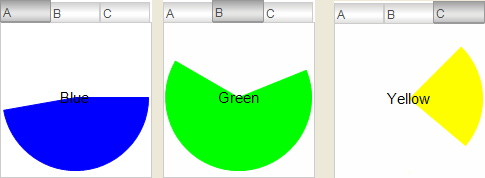

# Calling visualization with interface (VAR\_IN\_OUT)

Requirement: The project contains a visualization and a main visualization. The main visualization contains an element that the visualization references.

1. Open the visualization.
2. Assign a type-compliant transfer parameter to the interface variables in all calls by entering an application variable in **Value**. Exit the dialog.

   * A transfer parameter is assigned at the points where the visualization is to be referenced. These now appear in the main visualization in the **References** property.

**Example**

The `visPie` visualization contains an animated, colored pie. The `visMain` main visualization calls the `visPie` visualization multiple times in **Tabs**. Color information, angle information, and label are transferred via the `pieToDisplay` interface variable. The pies vary at runtime.

Visualization `visPie`:



Properties of the Pie element:

|  |  |
| --- | --- |
| **Variable for begin** | `pieToDisplay.iStart` |
| **Variable for end** | `pieToDisplay.iEnd` |
| **Texts → Text** | %s |
| **Text variables → Text variable** | `pieToDisplay.sLabel` |
| **Color variable → Normal state** | `pieToDisplay.dwColor` |

Interface of the visualization `visPie`:

```
                            VAR_IN_OUT
                            pieToDisplay : DATAPIE;
                            END_VAR
```

**Main visualization `visMain`**:

Properties of the "Tabs" element:

|  |  |
| --- | --- |
| **References** |  |
| **visPie** |  |
| **Heading** | `A` |
| `pieToDisplay` | `PLC_PRG.pieA` |
| **visPie** |  |
| **Heading** | `B` |
| `pieToDisplay` | `PLC_PRG.pieB` |
| **visPie** |  |
| **Heading** | `C` |
| `pieToDisplay` | `PLC_PRG.pieC` |

`DATAPIE (STRUCT)`

```
TYPE DATAPIE : // Parameter type used in visPie
STRUCT
    dwColor : DWORD; // Color data
    iStart : INT; // Angle data
    iEnd : INT;
    sLabel : STRING;
END_STRUCT
END_TYPE
```

`GVL`

```
{attribute 'qualified_only'}
VAR_GLOBAL CONSTANT
    c_dwBLUE : DWORD := 16#FF0000FF; // Highly opaque
    c_dwGREEN : DWORD := 16#FF00FF00; // Highly opaque
    c_dwYELLOW : DWORD := 16#FFFFFF00; // Highly opaque
    c_dwGREY : DWORD :=16#88888888; // Semitransparent
    c_dwBLACK : DWORD := 16#88000000; // Semitransparent
    c_dwRED: DWORD := 16#FFFF0000;  // Highly opaque
END_VAR
```

`PLC_PRG`

```
PROGRAM PLC_PRG
VAR
    iInit: BOOL := TRUE;
    pieA : DATAPIE; // Used as argument when visPie is called
    pieB : DATAPIE;
    pieC : DATAPIE;
    iDegree : INT; // Variable center angle for the pie element used for animation
END_VAR

IF iInit = TRUE THEN
    pieA.dwColor := GVL.c_dwBLUE;
    pieA.iStart := 0;
    pieA.sLabel := 'Blue';

    pieB.dwColor := GVL.c_dwGREEN;
    pieB.iStart := 22;
    pieB.sLabel := 'Green';

    pieC.dwColor := GVL.c_dwYELLOW;
    pieC.iStart := 45;
    pieC.sLabel := 'Yellow';

    iInit := FALSE;
END_IF
iDegree := (iDegree + 1) MOD 360;
pieA.iEnd := iDegree;
pieB.iEnd := iDegree;
pieC.iEnd := iDegree;
```

Main visualization `visMain` at runtime:



17.0

© Copyright 2026, CODESYS GmbH