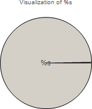
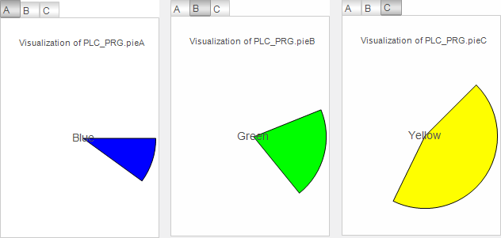

# Printing the instance name of a transfer parameter

In order to obtain and output the instance name of a transfer parameter, you can implement an interface variable (data type `STRING`) with the pragma `{attribute 'parameterstringof'}` in the `VAR_INPUT` scope.

The project contains a visualization and a main visualization. The main visualization contains elements that the visualization references.

1. Open the visualization.
2. In the **Text variables****Text variable** property, assign the interface variable to the text field.

   * `sNameToDisplay`

     `visPie` has a heading.

**Example**

The `visPie` visualization consists of one pie until now. The `visMain` main visualization calls `visPie` in **Tabs** three times with different transfer parameters.

`visPie` is extended with a text field which outputs the name of the actual parameters passed to the visualization. In addition, the interface of `visPie` is extended with a string variable which contains the instance name of the specified transfer parameter. At runtime, each pie is overwritten.



Properties of the "Text Field" element:

|  |  |
| --- | --- |
| **Texts**, **Text** | `Visualization of %s` |
| **Text variables**, **Text variable** | `sNameToDisplay` |

Interface of the `visPie` visualization

```
VAR_INPUT
    {attribute 'parameterstringof' := 'pieToDisplay'}
    sNameToDisplay : STRING;
END_VAR
VAR_IN_OUT
    pieToDisplay : DATAPIE;
END_VAR
```

Main visualization `visMain` at runtime:



17.0

© Copyright 2026, CODESYS GmbH