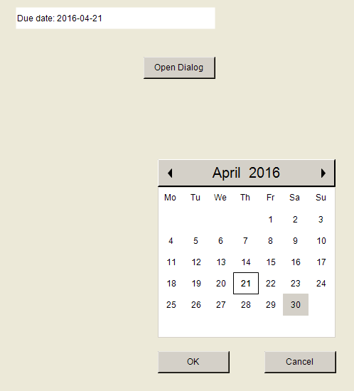

# Configuring a dialog call

For dialog calls, a user usually clicks a button that opens a dialog and prompts the input.

In the following example, a dialog is displayed as a calendar and allows for the input of a date.

Requirement: The project includes the visualizations `visMain` and `dlgCalender`.

1. Set the visualization type from `dlgCalender` to dialog.
2. Compile, download, and start the application.

   * 

Variable declaration

```
PROGRAM PLC_PRG
VAR
    dateDue : DATE := DATE#2000-01-01;
    dateCalendar : DATE;
END_VAR
```

17.0

© Copyright 2026, CODESYS GmbH