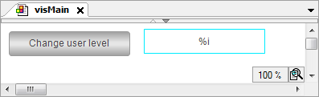
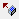
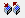
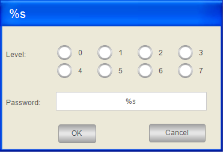
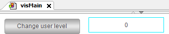
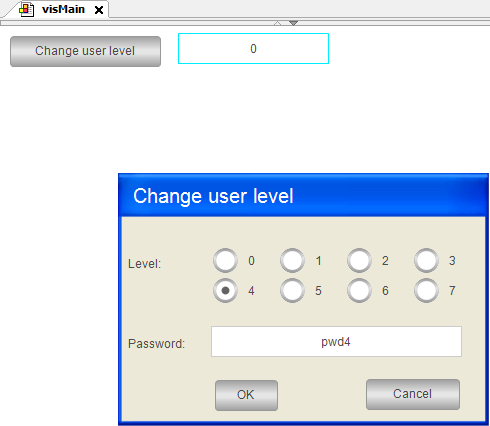
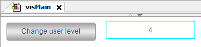

# Example

Below you will find an example of the implementation of the `visMain` visualization and the `visChangeUserLevel` dialog.

**Main visualization: `visMain`**



Element list of the `visMain` visualization

| Type | Name | Element properties | Description |
| --- | --- | --- | --- |
| `Text Field` | User level | **Texts → Text** : `%i` | Output with placeholder |
|  |  | **Text variables → Text variable**: `PLC_PRG.iLevel` | Assignment of the `PLC_PRG.iLevel` variables to the placeholder. Includes the level number. |
| `Button` | `Button for change user level` | **Texts → Text**: `Change user level` |  |
|  |  | **Input configuration → OnMouseDown → Open dialog**: `Open Dialog: visChangeUserLevel` | When a user clicks the `Change User Level` button, the `visChangeUserLevel` dialog opens with the parameter list stored here.  Hint: Click **Configure** to view the stored configuration in the **Input configuration** dialog → **Open dialog** input action. |

**Input configuration of the button**

The **Open dialog** input action is implemented for the "Change user level" button. As a result, a dialog opens (`OnMouseClick)`).

|  |  |
| --- | --- |
| **Dialog** | `visChangeUserLevel`  The list box automatically provides all project-wide visualizations which have been configured as dialogs. |

|  |  |  |  |
| --- | --- | --- | --- |
| `sItfTitle` | `STRING` | `'Change user level'` | Passing of a string for the title. |
| `sItfLevel0` | `STRING` | `'pwd0'` | Passing of a string as password for Level0. |
| `sItfLevel1` | `STRING` | `'pwd1'` | Passing of a string as password for Level1. |
| `sItfLevel2` | `STRING` | `'pwd2'` | Passing of a string as password for Level2. |
| `sItfLevel3` | `STRING` | `'pwd3'` | Passing of a string as password for Level3. |
| `sItfLevel4` | `STRING` | `'pwd4'` | Passing of a string as password for Level4. |
| `sItfLevel5` | `STRING` | `'pwd5'` | Passing of a string as password for Level5. |
| `sItfLevel6` | `STRING` | `'pwd6'` | Passing of a string as password for Level6. |
| `sItfLevel7` | `STRING` | `'pwd7'` | Passing of a string as password for Level7. |
| `iItfLevel` | `INT` | `PLC_PRG.iLevel` | Passing of a variable for the level specified by the user. |
| `sItfPwd` | `STRING` | `PLC_PRG.sPwd` | Passing of a variable for the password. |

List: "Update  and  parameter in case of result"

| **Use** | Value |  |
| --- | --- | --- |
|  | **OK** | When the visualization user clicks the button, the dialog opens and the result "OK" is returned. |

|  |  |
| --- | --- |
| **Open dialog modal** | Enabled as a result, inputs outside of the dialog are not possible. |

**Dialog: `visChangeUserLevel`**

The dialog provides elements for selecting the level and entering the password.

If the password matches, then the **OK** button is enabled. Then the user can close the dialog. The input of the level is also applied.



Declaration of the interface of dialog `visChangeUserLevel`:

```
VAR_INPUT
    sItfTitle: STRING; // titel of the dialog box
    sItfLevel0: STRING; //password level 0
    sItfLevel1: STRING; //password level 1
    sItfLevel2: STRING; //password level 2
    sItfLevel3: STRING; //password level 3
    sItfLevel4: STRING; //password level 4
    sItfLevel5: STRING; //password level 5
    sItfLevel6: STRING; //password level 6
    sItfLevel7: STRING; //password level 7
END_VAR
VAR_IN_OUT
    iItfLevel: INT; // user input: level
    sItfPwd: STRING; //user input: password
END_VAR
```

Element list of the dialog

| Type | Name | Element properties | Description |
| --- | --- | --- | --- |
| `#0 Image` | `Background` | **Static ID**: `VisuDialogs.ImagePoolDialogs.Login` | The property assigns the image of a blank dialog with a gray background and a blank blue title bar to the element. The image is included in the **VisuDialogs** library. |
| `#1 Rectangle` | `Title` | **Texts → Text**: `%s` | Output with placeholder for text variable |
|  |  | **Text variables → Text variable**: `sItfTitle` | Assignment of interface variable `sItfTitle` for which a parameter is passed when called. |
| `#2 Radio button` | `Input level` | **Variable**: `iItfLevel` | Assignment of interface variable `iItfLevel` for which a parameter is passed when called. Includes the user input at runtime. |
|  |  | **Number of columns**: `4` |  |
|  |  | **Radio button order**: **Left to right** | Appearance |
|  |  | **Radio button settings → Radio button → Areas**: [0] bis [7]  **[<n>] → Text**: <n> | Label of eight radio buttons with numbers from 0 to 7 |
| `#3 Text field` | `Input password` | **Texts → Text**: `%s` | Output with placeholder for text variable |
|  |  | **Text variables → Text variable**: `sItfPwd` | Assignment of interface variable `sItfPwd` for which a parameter is passed when called. Includes the user input at runtime. |
|  |  | **Input configuration → OnMouseDown → Write Variable**: `Variable:,InputType:Edit,Use text output variable: TRUE` | In the **Input configuration** dialog, **Text input** is selected for the **Input type** list box and the option **Use text output variable** is activated. |
| `#4 Text field` | `Label for level` | **Texts → Text**: `Level:` | Label |
| `#5 Text field` | `Label for password` | **Texts → Text**: `Password` | Label |
| `#6 Button` | `OK` | **Texts → Text**: `OK` | Label |
|  |  | **Colors → color**: `Element base color`  **Colors → Alarm color**: `Alarm filling color` | Configuration of the display in state-dependent colors. You can switch between colors. |
|  |  | **Color variables → Toggle color**: `sItfPwd <> MUX(iItfLevel, sItfLevel0, sItfLevel1, sItfLevel2, sItfLevel3, sItfLevel4, sItfLevel5, sItfLevel6, sItfLevel7);` | If the password and the user input do not match, then the expression is `TRUE`. Then the button is displayed in the alarm color. |
|  |  | **State variables → Deactivate inputs**: `sItfPwd <> MUX(iItfLevel, sItfLevel0, sItfLevel1, sItfLevel2, sItfLevel3, sItfLevel4, sItfLevel5, sItfLevel6, sItfLevel7);` | If the password and the user input do not match, then the expression is `TRUE`. The button is deactivated.  If the password matches, then the button is enabled. |
|  |  | **Input configuration → OnMouseDown → Close dialog**: `Close Dialog: visChangeUserLevel, Result: OK` | When a user clicks the **OK** button, the `visChangeUserLevel` dialog will be closed and the parameters will be updated. |
| `#7 Button` | `Cancel` | **Texts → Text**: `Cancel` | Label |
|  |  | **Colors → color**: `Element base color` | Appearance |
|  |  | **Input configuration → OnMouseDown → Close dialog**: `Close Dialog: visChangeUserLevel, Result: Cancel` | When a user clicks the **Cancel** button, the `visChangeUserLevel` dialog will be closed. |

**Input configuration: OK button**

List: "Update  and  parameter in case of result"

|  |  |  |
| --- | --- | --- |
|  | **OK** | When the visualization user clicks the button, the dialog opens and the result "OK" is returned. |

**Input configuration: Cancel button**

List: "Update  and  parameter in case of result"

|  |  |  |
| --- | --- | --- |
|  | **Cancel** | When the visualization user clicks the button, the dialog opens and the result "Cancel" is returned. |

**Implementation of `PLC_PRG`:**

```
PROGRAM PLC_PRG
VAR
    iLevel: INT;
    sPwd : STRING;
END_VAR
```

**Visualization at runtime**



After clicking the button, the dialog opens and permits inputs. If the specified text matches the stored text, then **OK** is enabled:



After clicking **OK**, the selection is applied.



TIP:

The example shows the procedure for multiple return values. However, the password can be returned more easily with a local variable in the dialog.

17.0

© Copyright 2026, CODESYS GmbH