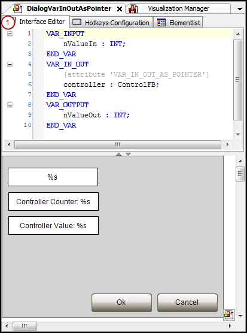
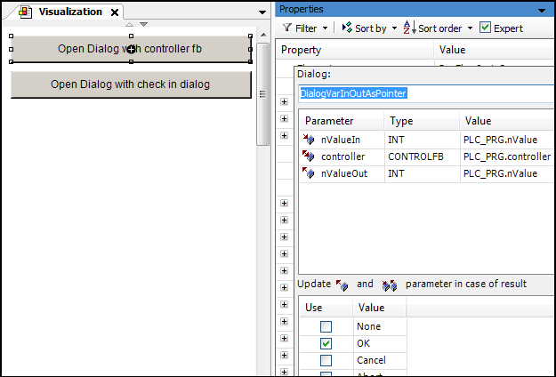

# Passing of pointers as parameters

To pass a complex data structure, you can flag an interface variable of type `VAR_IN_OUT` with the pragma attribute `VAR_IN_OUT_AS_POINTER` and pass a pointer or reference to it as a parameter.

**Procedure for using references**

1. Declare the user data object (`DUT`).
2. Program the user interface: use the dialog in a visualization or assign the dialog in the input configuration of a visualization element. Then access to the referenced data is possible.

**Example: Using an interface with the 'VAR\_IN\_OUT\_AS\_POINTER' pragma**

```
FUNCTION_BLOCK ControlFB
VAR_INPUT
END_VAR
VAR_OUTPUT
END_VAR
VAR
    bOk : BOOL := TRUE;
    nCounter : INT;
    nValue : INT;
END_VAR
nCounter := nCounter + 1;
```

Declaration of an interface variable with `VAR_IN_OUT_AS_POINTER`



User interface: Dialog opens:



17.0

© Copyright 2026, CODESYS GmbH