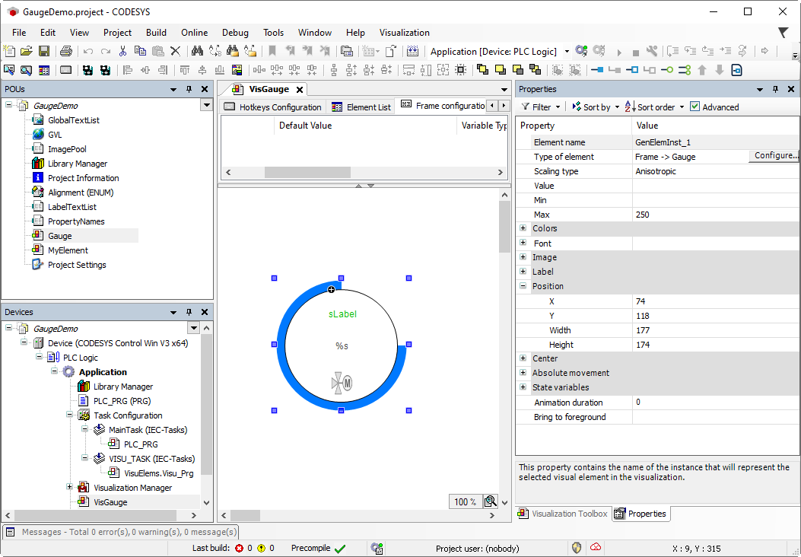

# Configuring a Frame Interface

A visualization which exists in the pool in the **POUs** view should represent a special `Gauge` measurement control. This visualization should be reusable. When reusing, only a few selected properties should have to be configured. That is why the visualization gets a frame interface

1. Double-click the `Gauge` visualization object.

   * `Gauge` is displayed in the visualization editor. The **Frame Configuration** tab is displayed in the top part. The properties for the frame interface are defined there.
2. Add the `Gauge` visualization to the **Selected visualizations**.

   * `Gauge` is displayed in the superordinate `VisGauge` visualization. In the **Properties** view, the properties are displayed as defined on the **Frame Configuration** tab.

     `VisGauge` visualization used as element 

17.0

© Copyright 2026, CODESYS GmbH