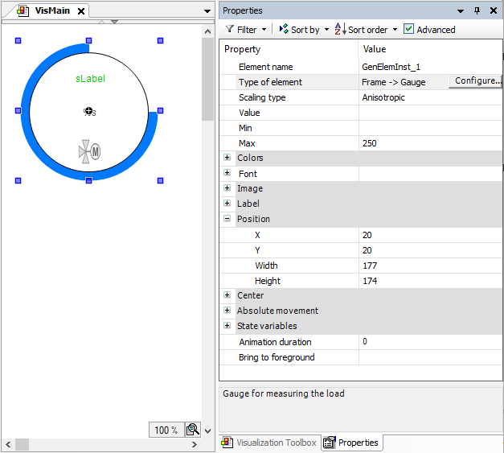

# Configuring descriptions

To support the application developer, for example, you can configure descriptive texts for the interface, both for the visualization as a whole as well as for each interface property. The texts are managed in text lists. In the frame configuration, the IDs of the text list are then assigned in the **Description ID** column. Managing the texts in text lists allows you to localize the texts and helps to keep a clear overview.

Alternatively, you could also enter a text directly in the **Default Value** column. The requirement for this is that the field in the **Description ID** column is empty. As a result, localization is not possible.

The descriptions are displayed when the application developer selects the referencing frame element in a superordinate visualization. Then, depending on the selected property, the corresponding text appears in the comment window in the **Properties** view.

**Configuring descriptions for the `Gauge` visualization and its properties**

1. In the **POUs** view, add a text list named `PropertyNames`.
2. Reference `Gauge` in another, superordinate visualization.

   1. Switch to the **Visualization Toolbox** view.
   2. Click the **Current Project** button.
   3. Drag the `Gauge` visualization to the visualization editor.

      * In the **Properties** view, the interface properties are displayed as configured.
   4. Select the element properties one after the other.

      * The respective texts are displayed in the comment field below it. In the case of the **Element type** property, for example, the element description is displayed.
   * Referenced `Gauge` visualization in `VisMain` 

17.0

© Copyright 2026, CODESYS GmbH