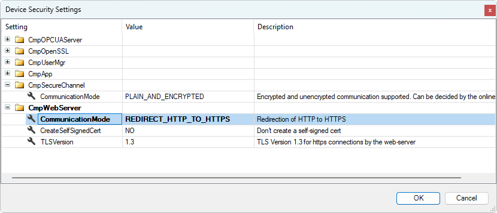
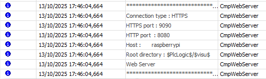
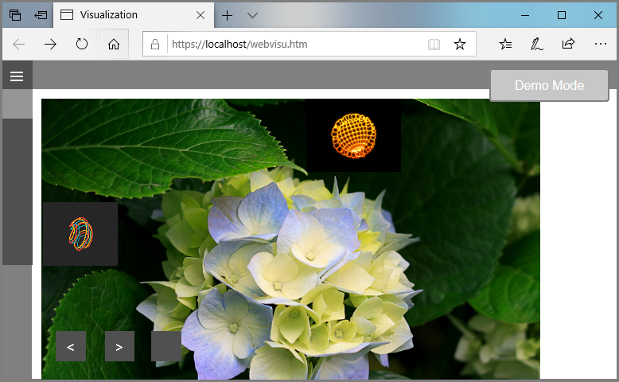

# Using an encrypted HTTPS connection

IMPORTANT:

Prefer the use of CA-signed certificates.

NOTE:

For a certificate to be considered secure by the browser, it must have been signed by a certification authority. As a rule, every browser has a list of trusted certification authorities. Such a certificate can be checked by the browser itself so that no warning message appears in the browser when a secure connection is established. Signing a certificate from one of these trusted certification authorities is not usually free of charge.

Alternatively, you could also use a certificate you have created yourself. The disadvantage is that this certificate has to be checked in the browser. The browser issues a warning that the connection is not trusted. You can then add an exception so that this warning does not appear every time this connection is opened. However, to make sure that communication is actually taking place with the correct controller, it is necessary to compare the signature value of the certificate with the signature value of the certificate on your own controller.

A certificate is required to establish a secure connection between your browser and the web server via an HTTPS connection. It is advisable to use the CODESYS Security Agent to install a valid control certificate for encrypted communication.

**Installing the CODESYS Security Agent**

1. Click the **View → Store** command and sign in.
2. Exit the dialog.

**Creating a certificate**

1. Configure the communication settings and the gateway for your device.
2. Download the application with the visualization for the CODESYS WebVisu to this device.

   * Your device is ready for a secure connection.

**Establishing an HTTPS connection**

1. Check the configuration of the web server in your CODESYS runtime system CODESYS Control Win as described in the following steps.

   For more information, see the following: CODESYS Control Win V3

   1. Is HTTPS enabled on the web server?

      ```
      [CmpWebServer]
      ConnectionType=3
      ```

      Possible values:

      `HTTP_ONLY, /* = 0 */`

      `HTTPS_ONLY, /* = 1 */`

      `HTTP_AND_HTTPS, /* = 2 */`

      `REDIRECT_HTTP_TO_HTTPS /* = 3 */`

      * **Alternative**

        In CODESYS, open the device editor and then switch to the **Communication Settings** tab.

        In der menu bar above, select the **Device** → **Device Security Settings** command. The **Device Security Settings** dialog will open. There you can adapt the configuration under the **Value** column.

        In the `CmpWebServer` area of the settings for the web server, you will find the `CommunicationMode` setting. Here you can edit the desired communication mode.

        If necessary, set the value of `CommunicationMode` to `REDIRECT_HTTP_TO_HTTPS` and then click **OK** to apply the values on the device.

        + Dialog: **Device Security Settings**

          
   2. If port 443 is already in use, then it can be changed to a different value.

      ```
      [CmpWebServer]
      WebServerSecurePortNr=443 // HTTPS 
      ```

      Possible value:

      `WebServerPortNr=9090 // HTTP`
   3. Are the web server settings stored in the log file as expected?

      
2. Check the certificate information. If it is correct, then confirm that you understand the risk and want to continue.

   * You have created a self-signed certificate. Its validity can be validated, for example by the **Thumbprint** by displaying the thumbprint in the browser and then comparing with the value from the Security Agent.

     Now the WebVisu page starts. The lock symbol in the browser indicates secure communication.

     

IMPORTANT:

**BeagleBone Black**

If you use a BeagleBone Black as a visualization device, then you need to note that a BeagleBone Black uses port 9090 for its web server. A valid URL would then be:

`http://192.168.7.2:9090/webvisu.htm`

17.0

© Copyright 2026, CODESYS GmbH