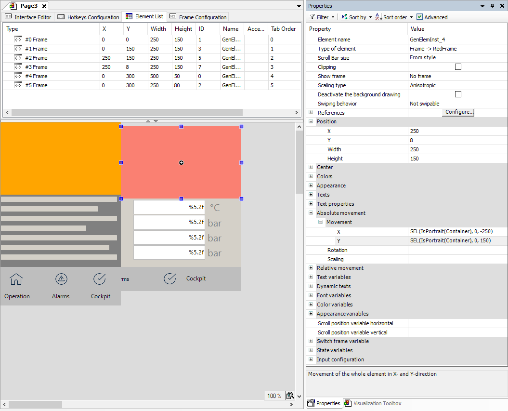

# Using the "Isotropic" or "Anisotropic" scaling type

With the "isotropic" and "anisotropic" scaling types, the full contents of a main page is scaled to the display size provided by the client. If the page orientation of a tablet, for example, is rotated from landscape to portrait, then the contents do not match the aspect ratio. Large bars are created and the page cannot be filled optimally.

In order to avoid this, it was previously necessary to create a separate page (visualization) for each of the portrait and landscape formats. These are started via the `ClientListener` with the correct starting page. Now this can be achieved more easily via responsive resizing without having to duplicate the visualization objects.

With responsive resizing from landscape to portrait format, tiles which are farther to the right side are moved to the bottom right by an absolute movement. The current page size adapts dynamically to the current client size and the elements are optimally positioned within it. When changing from portrait to landscape format, the elements are moved in the opposite direction.

**Example**

The main page of a visualization consists of several "tiles" which are programmed with frame elements. These frame elements must be repositioned and moved if the orientation of the visualization changes and they are adapted to the current display size.

**Moving the tiles in the X and Y direction**

**Configure as follows:**

* Property: **Absolute movement**, **Movement**, **X**: `SEL(IsPortrait(Container), 0, -250)`
* Property: **Absolute movement**, **Movement**, **Y**: `SEL(IsPortrait(Container), 0, 150)`

Implementation of `IsPortrait` for determining the visualization size

```
FUNCTION IsPortrait : BOOL
    VAR_INPUT    sizeProvider : VisuElems.ISizeProvider;
END_VAR
IF sizeProvider.Width < sizeProvider.Height THEN 
    IsPortrait := TRUE;
END_IF
```

Calculation of the movement in the X and Y direction with typical expressions under the **Absolute movement** property:



17.0

© Copyright 2026, CODESYS GmbH