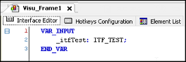
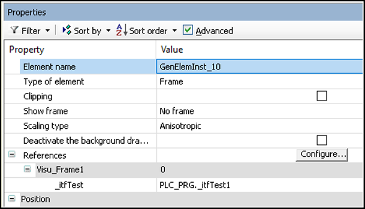
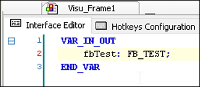
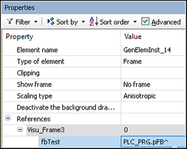
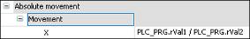

# Possible causes for the crash of a running visualization

**Possible causes for the crash of a running visualization**

* In the visualization, a frame element with an interface variable with scope `VAR_INPUT`  is used, and this interface variable (in the example: `PLC_PRG._itfTest1`, `_itfTest1 : ITF_TEST;`) has not been assigned in the application yet.

* In the visualization, a frame element with an interface variable (in the example: `fbTest`) with scope `VAR_IN_OUT` is used, and this interface variable has a function block as data type. However, the transferred variable does not point to this function block.

* Division by `0`: In an expression with division, the divisor (in the example: `PLC_PRG.rVal2)` must not be `0`.

* Use of `VAR_IN_OUT` variables of a function block in the visualization:

  If variables with scope `VAR_IN_OUT` are declared in a function block, then a visualization may access these variables only after the program has called the function block and the `VAR_IN_OUT` variables have been assigned in a function block.
* Use of zero pointers and zero references: A pointer variable must not be zero (example: `PLC_PRG.pValue^`).
* Error in the internal code; this is visible in the call stack only.

17.0

© Copyright 2026, CODESYS GmbH