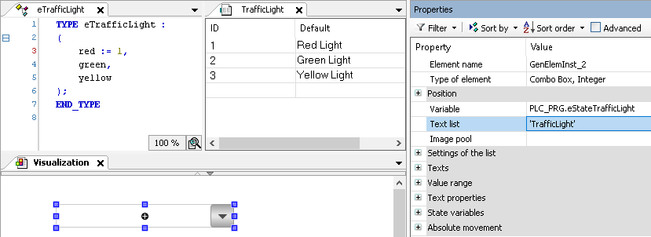

# Variable

|  |  |
| --- | --- |
| **Variable** | Variable to be edited via the combo box  To display texts matching a list, a corresponding text list must also be configured.  When an enumeration with text list support is used, no additional text list needs to be configured.   * Variable (integer data type). Only numeric IDs are allowed .  Example:  `PLC_PRG.iIDComboboxEntry`  `PLC_PRG.eStateTrafficLight` (see example below ”`TrafficLight`“) * Enumeration variable with text list support  Example: `PLC_PRG.eMyCombobox`  After the selection of the enumeration variable, the data type is supplemented automatically. |
| **Text List** | Name of the text list whose entries are displayed in the expanded combo box.  A maximum of 32766 entries can be displayed.   * Text list identifier as string  Example:  `'TextList_A'`  `'TrafficLight'` (see `TrafficLight` example below)  The IDs of the text list have to be within the value range of `DWORD` or `DINT`. * Blank    + When an enumeration variable with text list support is specified in the **Variable** property   + When only one image pool is displayed |
| **Image Pool** | Name of the image pool whose images are displayed as an entry in a combo box  Example: `'ImagePool_A'` |

**Example**

`TrafficLight`

17.0

© Copyright 2026, CODESYS GmbH