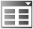

# Visualization Element: Combo Box, Array

Symbol:

Category: **Common Controls**

The element shows values of an array as a list box. When the visualization user clicks an entry, the array index of the entry is written to an integer variable.

17.0

© Copyright 2026, CODESYS GmbH