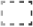

# Visualization Element: Invisible Input

Symbol:

Category: **Common Controls**

This element is displayed in the editor with a dashed line which is not visible in online mode. You define the behavior of the el in the input configuration.

17.0

© Copyright 2026, CODESYS GmbH