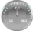

# Visualization Element: Meter

Symbol:

Category: **Measurement Controls**

The element displays the value of a variable. The needle is positioned according to the value of the assigned variable. A meter is used to represent a tachometer, for example.

17.0

© Copyright 2026, CODESYS GmbH