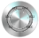

# Visualization Element: Potentiometer

Symbol:

Category: **Measurement Controls**

The element displays the value of a variable as a setting on the potentiometer. A visualization user can modify the value by dragging the pointer to another position.

17.0

© Copyright 2026, CODESYS GmbH