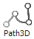

# Visualization Element: Path3D

NOTE:

The element does not work with the CODESYS HMI display variant.

Symbol:

Category: **Special Controls**

The **Path3D** visualization element graphically displays the curves of two independent records as a 3D path. It is specially designed for use with CNC in order to display the trajectory of a machine tool or a robot. The programmed path (path) and the path actually traveled (track) is displayed.

Although the visualization element is designed for use with CODESYS SoftMotion in CNC, it can also be used to display any other record. In this case the application has to provide the path data.

If the element is used together with CODESYS SoftMotion CNC, then function blocks from the library `SM3_CNC_Visu` help to generate the data from the path and track. These function blocks are used by the sample project `CNC_File_3DPath`, which is stored in the installation directory of CODESYS.

* `SMC_PathCopier`
* `SMC_PathCopierCompleteQueue`
* `SMC_PathCopierFile`
* `SMC_PositionTracker`

A description of the function blocks can be found in the Library Manager in the library `SM3_CNC_Visu`.

17.0

© Copyright 2026, CODESYS GmbH