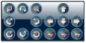

# Visualization Element: Control Panel

Symbol:

Category: **Special Controls**

This visualization element is used in connection with the **Path3D** visualization element. It is used for changing the position and orientation to the CNC path shown with the **[Path3D](_visu_elem_path3d.html#_visu_elem_path3d)** element.

17.0

© Copyright 2026, CODESYS GmbH